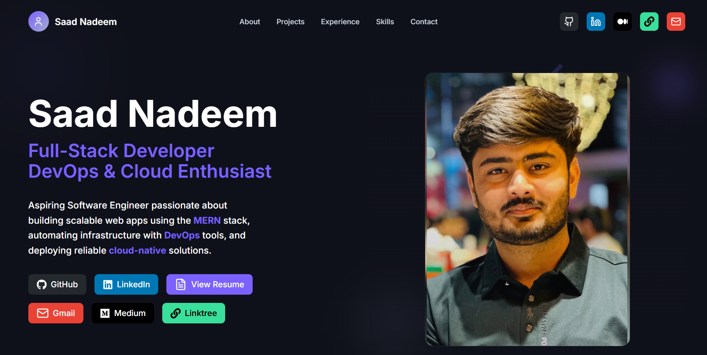
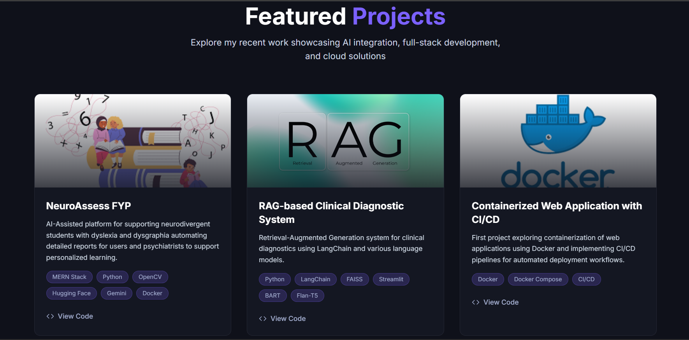
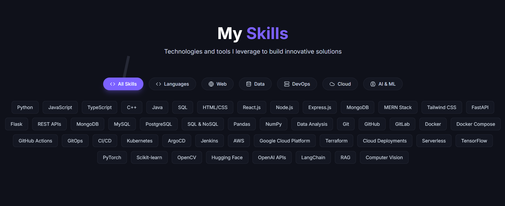

# 🚀 Saad Nadeem – Portfolio Website

Welcome to my personal portfolio website. This site showcases my work, skills, and projects in **Web Development**, **AI**, **DevOps**, and **Cloud Computing**.

🔗 **Live Site:** [saadnadeem07.github.io/portfolio](https://saadnadeem07.github.io/portfolio)

---

## 🛠 Tech Stack

- **Frontend:** React.js, HTML5, CSS3, JavaScript
- **Styling:** Tailwind CSS 
- **Deployment:** GitHub Pages

---

## 📸 Screenshots
## Landing Page


## Featured Projects


## Skills Section

---

## 🔍 Features

- Responsive design across devices
- Animated transitions for smooth user experience
- Projects section with GitHub links
- Contact form (integrated with EmailJS or custom backend)
- SEO-optimized structure
- Clean and modern UI

---

## ⚙️ Getting Started

To run the project locally:

```bash
# Clone the repo
git clone https://github.com/saadnadeem07/portfolio.git
cd portfolio

# Install dependencies
npm install

# Start development server
npm start

# To build for production:
npm run build

# To deploy to GitHub Pages:
npm run deploy
```

🧠 About Me
<br>
I’m a passionate developer focused on building impactful web applications and AI-powered tools using modern technologies. I enjoy working with DevOps practices and scalable cloud solutions.
<br>
<br>

📬 Contact <br> <br>

📧 Email: saadnadeem07@gmail.com <br>
💼 LinkedIn: linkedin.com/in/saadnadeem07 <br>
🌐 Portfolio: saadnadeem07.github.io/portfolio <br>

Made with ❤️ by Saad Nadeem
